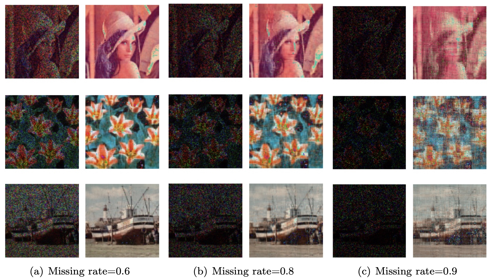

# [Tensor ring Decomposition!](https://github.com/) 


[](https://github.com/albermax/innvestigate)
[](https://github.com/albermax/innvestigate/blob/master/LICENSE)

## Table of contents

* [Introduction](#introduction)
* [Installation](#installation)
* [Usage and Examples](#usage-and-examples)
* [More documentation](#more-documentation)


## Introduction

Tensor networks have emerged as the powerful tools for solving the large-scale optimization problems in recent years and tensor ring decomposition has become popular as the building blocks for the complicated tensor networks. 
`TRDs` is a python package implementing tensor ring decomposition, which is licensed under BSD.
TRDs supports several basic tensor operations, four kinds of latent cores optimization algorithms in tensor ring decomposition based on the sequential SVDs, ALS scheme, and block-wise ALS techniques, as well as a tensor completion method based on TR decomposition.

For an overview of tensor ring decompositions please see the following: 

- [**Tensor Ring Decomposition**. Qibin Zhao, Guoxu Zhou, Shengli Xie, Liqing Zhang, Andrzej Cichocki, 2016. 
.](https://jmlr.org/papers/v20/18-540.html)

## Installation
You can install TRDstest using *pip*. 
```bash
pip install TRDstest
```
Dependencies: TRDstest works with *Python 3.5* or later. TRDstest depends on *NumPy* (version >= 1.19) 

## Usage and Examples
The TRD library contains implementations for the following methods:
* *TRD.base:* implements core tensor operations.
    * **unfold:** Mode-n unfolding of a tensor.
    * **fold:** Refolds the Mode-n unfolded tensor.
    * **tensor2vec:** Vectorization of a tensor.
    * **vec2tensor:** Reshape the vectorised tensor to tensor.
* *TRD.functions:*  contains utilities for tensor algebra operations.
    * **n_mode_product:** The n-mode product of a tensor with a matrix.
    * **inner_product:** The inner product of two tensor with same shape.
    * **n_mode_inner_product:** The n mode inner product of two tensor.
    * **outer_products:** The outer product of a list of tensors.
    * **kronecker:** The Kronecker product of a list of matrices.
    * **khatri_rao:** The Khatri-Rao product of a list of matrices.
* *TRD.decomposition:* implements four different algorithms to optimize the latent cores in TR decomposition, and a tensor completion algorithm 
    * **TRSVD:** uses d sequential singular value decomposition (SVD), which is generally efficient in computation due to its non-recursion property and it can approximate an arbitrary tensor as close as possible.
    * **TRALS:** are based on alternating least squares (ALS) framework.
    * **TRALSAR:**  (ALS with adaptive ranks) is able to adapt TR-ranks during optimization.
    * **TRLRF:** is a tensor completion algorithm named tensor ring low-rank factors (TRLRF).

The code below shows a simple demo of tensor completion method,

```python
# Completion of a 256*256*3 image by TRLRF
import numpy as np
import matplotlib.pyplot as plt
from PIL import Image
from TRD.functions import gen_W
from TRD.decompositions import TRLRF

# Load data
X = (np.array(Image.open('trdstest/lena.bmp'), dtype='double') / 255)
# The missing rate of the image is set 0.8
mr = 0.8  # missing rate
W = gen_W(X.shape, mr)
# Calling Method of TRLRF
r = 5 * np.ones(3, dtype='int')  # TR-rank
X_completion, _, __ = TRLRF(X, W, r)
plt.figure()
plt.imshow(np.array(X_completion * 255, dtype='uint8'))
plt.show()
```

Image completion results of TRLRF method


## More documentation

You can find different examples in the directory examples, they are supplied in the form of Jupyter notebooks:
* *[Tensor_basic.ipynb](./docs/Tensor_basic.ipynb):* shows how to use TRDs to perform basic tensor operations.
* *[Tensor_function.ipynb](./docs/Tensor_function.ipynb):* shows how to use TRDs to perform tensor algebra functions, including n-mode product, inner product, outer_products, etc.
* *[Tensor_ring_decomposition.ipynb](./docs/Tensor_ring_decomposition.ipynb):* shows how to use TRD.decomposition to implement the tensor decomposition algorithm.

If you find any bugs or have any other suggestions on how to improve the code then please use the issue tracker on github (https://github.com/xxxxxxxxxxxxxxx).
